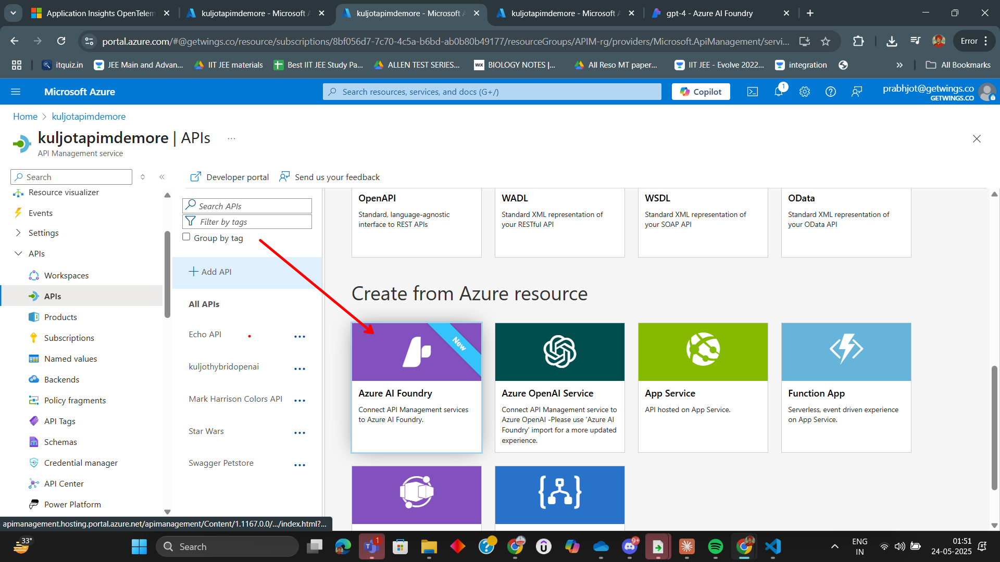
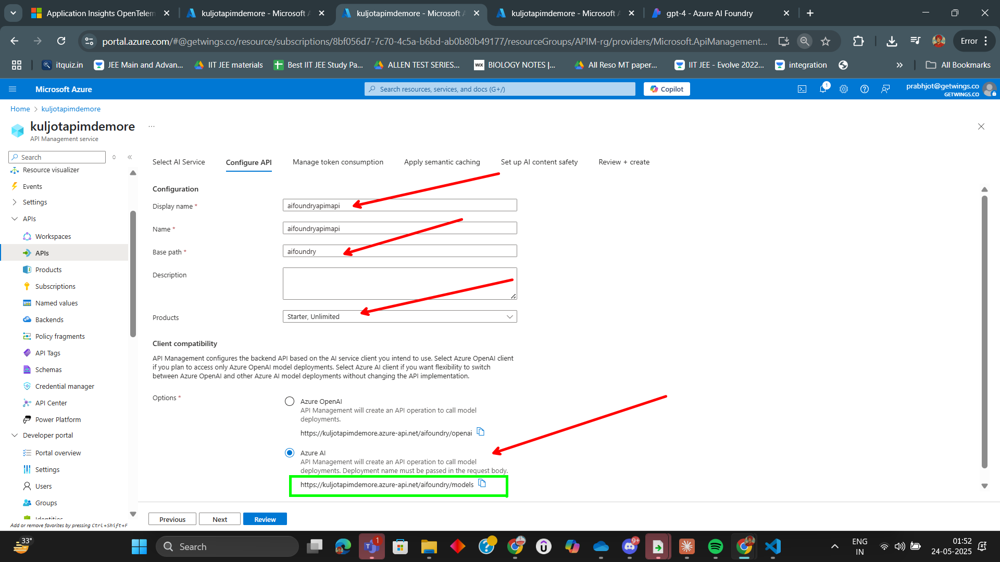
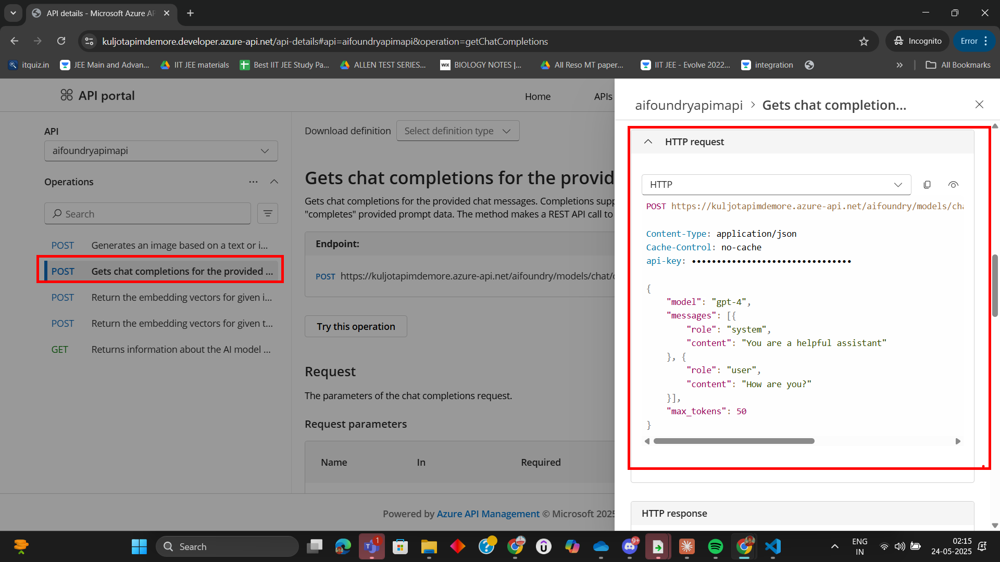

# Lab: Setting Up AI Foundry with Azure API Management (APIM)

In this lab, you will integrate AI Foundry with Azure API Management (APIM), configure environment variables, make sample API calls, analyze response headers, test rate limiting, and monitor usage. Stepwise images from the `AI_Foundry_With_APIM/Assets` folder (named with the `AIFOUNDRYAPIM` prefix) are included for visual guidance.

---

## Prerequisites

- Azure subscription
- AI Foundry deployment (e.g., GPT-4 or GPT-4o) endpoint
- Azure API Management instance
- Python 3.x and `pip` installed

---

## Step 1: Get Started with AI Foundry API

Begin by reviewing the AI Foundry API documentation and prerequisites.

---

## Step 2: Import AI Foundry API into APIM

1. In your APIM instance, go to the **APIs** section.
2. Click **+ Add API** and select **HTTP** or **OpenAPI**.
3. Import the AI Foundry endpoint or OpenAPI specification.
4. Set up the required operations (e.g., `/models/chat/completions`).

---

## Step 3: Test API From Developer Portal

---

