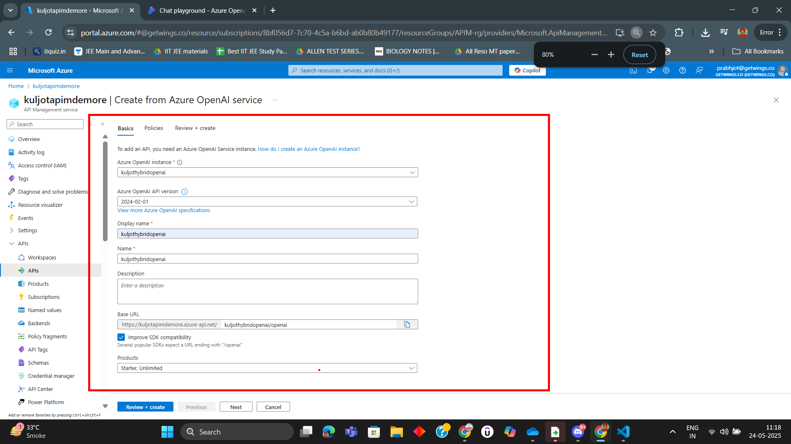
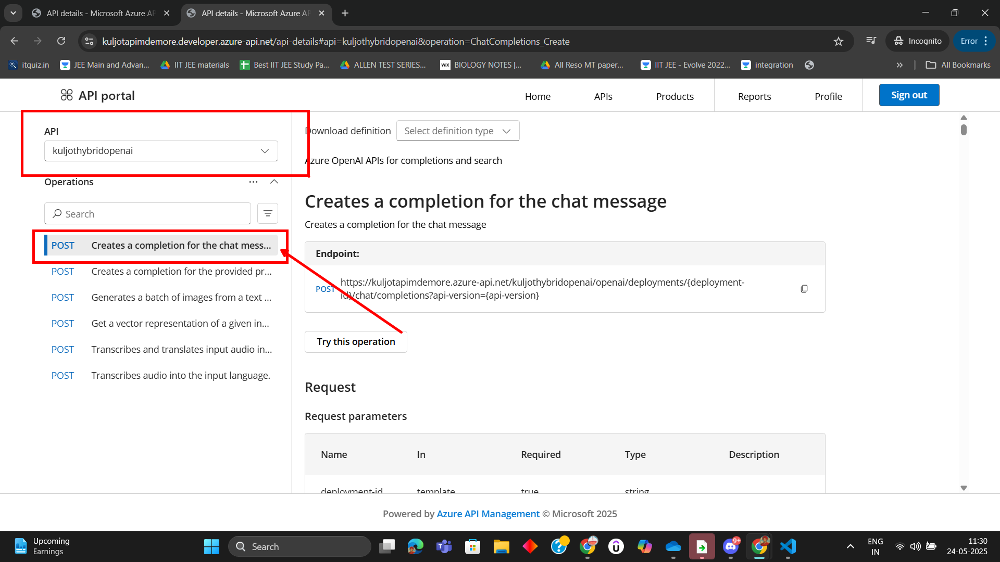

# Lab: Azure OpenAI with API Management (APIM)

In this lab, you'll learn how to integrate Azure OpenAI with Azure API Management (APIM), configure your environment, and test inferencing and image processing scenarios.

---

## Step 1: Define the Azure OpenAI API in APIM

Begin by defining your Azure OpenAI API in Azure API Management.

---

## Step 2: See the API in the Dev Portal
See the newly created API in the APIM Dev Portal

