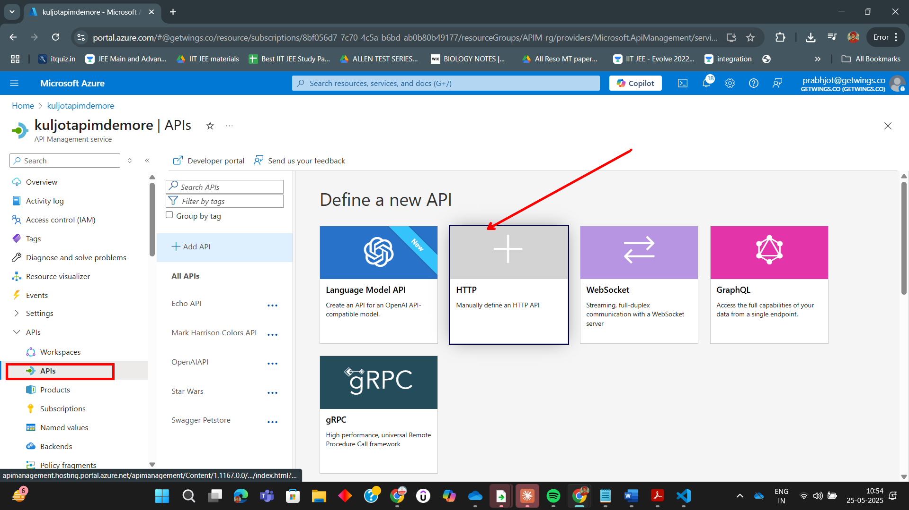
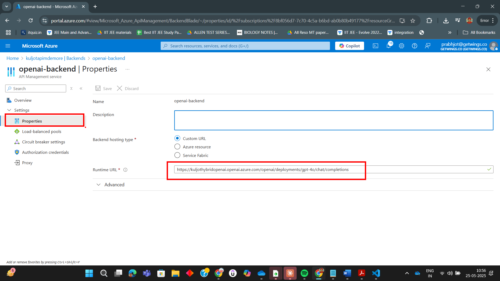
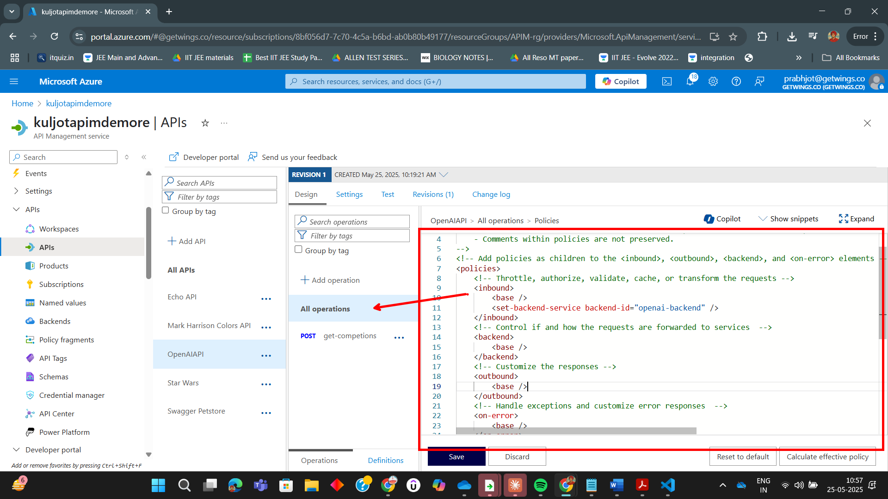
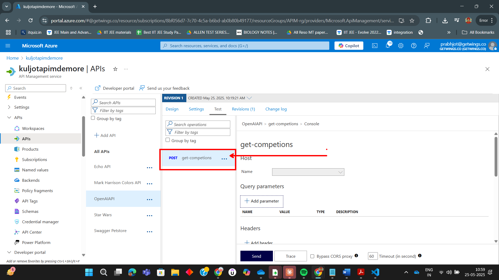

# Lab: Creating an OpenAI API in APIM from Scratch

In this lab, you'll learn how to create an OpenAI-compatible API in Azure API Management (APIM) from scratch. You'll define the API, configure operations, set up backend policies, and test your deployment. Follow the step-by-step instructions and refer to the images in the `Assets` folder for guidance.

---

## Step 1: Create a New HTTP API in APIM

Begin by creating a new HTTP API in your APIM instance.

---

## Step 2: Create APIM Backend

Create an APIM Backend as shown in the image

---

## Step 4: Configure Policy

Edit the policy for your API to set the backend service and apply any required transformations or authentication.

---

## Step 5: Test the API

Use the APIM Test Console or Developer Portal to send a sample request to your new API and verify the response.

---

## Summary

You have successfully created an OpenAI-compatible API in Azure API Management from scratch. This setup allows you to manage, secure, and monitor your OpenAI endpoints using APIM.

---