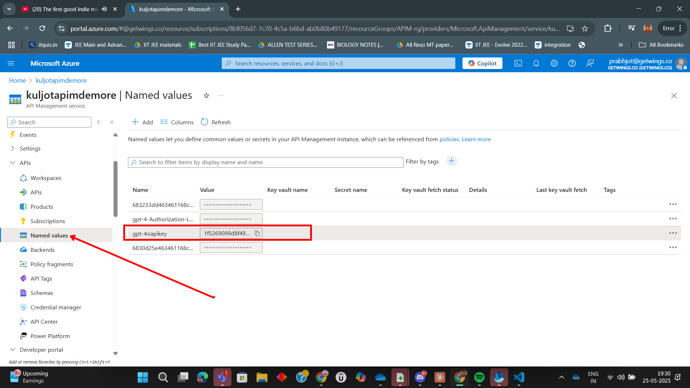
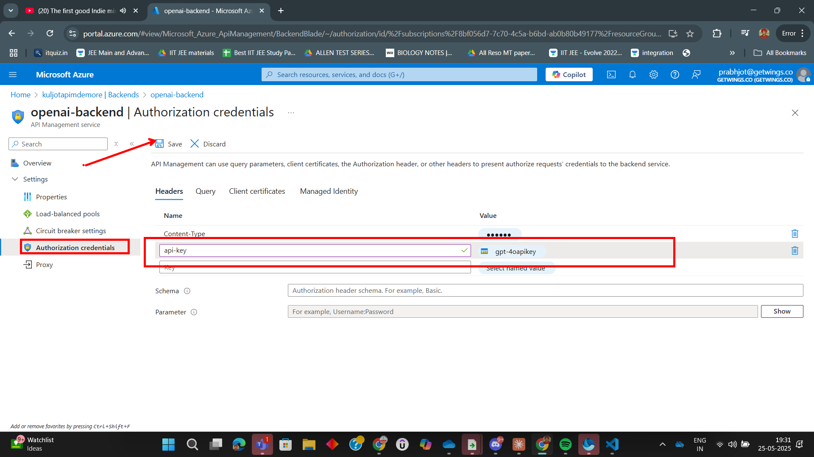

# Lab: Using Named Values in Backend APIM Authentication

In this lab, you'll learn how to securely use **Named Values** in Azure API Management (APIM) to store sensitive information (like API keys) and reference them in your backend authentication policies. 

---

## Step 1: Create a Named Value to Store the API Key

Start by creating a Named Value in APIM to securely store your backend API key.

---

## Step 2: Add Named Value to Backend Service

Associate the Named Value with your backend service configuration.

---

## Step 4: Test the API with Named Value Authentication

Test your API to ensure that the backend authentication works using the Named Value.

---

## Summary

You have successfully used Named Values in Azure API Management to securely manage backend authentication. This approach helps you keep sensitive information out of your policies and makes it easier to update credentials without modifying policy files.

---