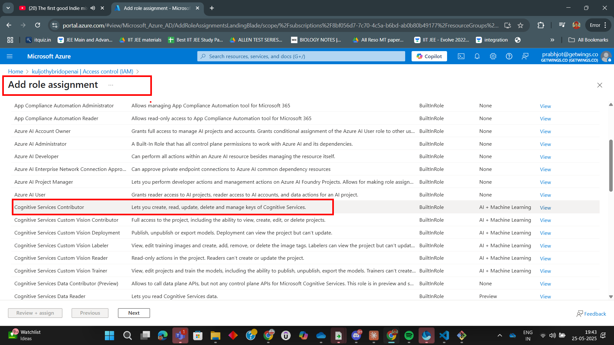
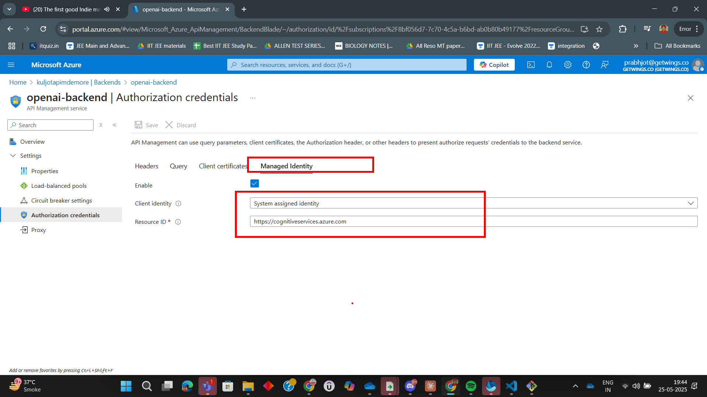

# Lab: Enabling Managed Identity Authentication with Managed Identities in Azure APIM

In this lab, you'll learn how to securely enable Managed Identity authentication for your backend (such as Azure OpenAI or Cognitive Services) using Azure API Management (APIM). You'll assign the necessary role, configure APIM policies, and test the integration. Follow the steps below and refer to the images in the `Assets` folder for guidance.

---

## Step 1: Assign Cognitive Services Contributor Role to APIM Managed Identity

Begin by assigning the **Cognitive Services Contributor** role to your APIM's managed identity on the target Azure Cognitive Service (e.g., Azure OpenAI).

---

## Step 2: Confirm Managed Identity Assignment

Verify that the managed identity is correctly assigned and visible in the Azure Portal.

---

## Step 3: Configure Managed Identity Authentication Policy in APIM

Edit your API policy in APIM to use the managed identity for backend authentication. This will automatically acquire a token and set the `Authorization` header for requests to the backend.

---

## Step 4: Configure APIM Policy

Change the APIM policy to support managed identity authentication.

---

## Step 5: Test the API with Managed Identity Authentication

Use the APIM Test Console or Developer Portal to send a request and verify that authentication is working as expected.

---

## Summary

You have successfully enabled Managed Identity authentication in Azure API Management. This approach allows APIM to securely access Azure services without storing secrets or keys, improving both security and manageability.

---