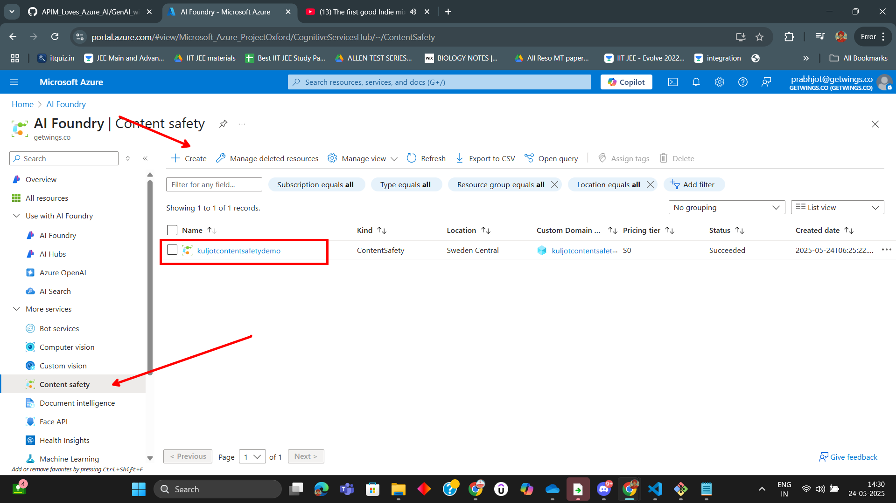
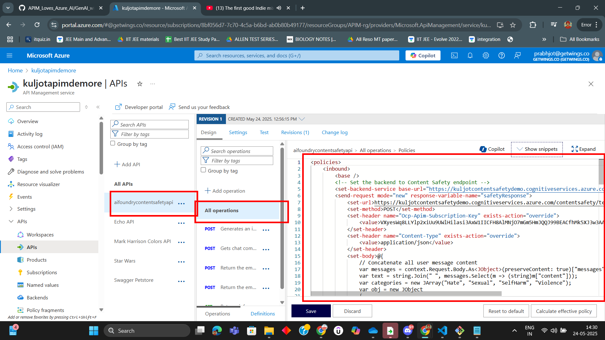

# Lab: Content Safety with Azure API Management (APIM)

In this lab, you'll learn how to integrate Azure Content Safety with Azure API Management (APIM), configure a content safety policy, and test it using API calls.

---

## Step 1: Create Content Safety Resource

Begin by creating an Azure Content Safety resource.

---

## Step 2: Add Content Safety Policy to APIM

Navigate to your APIM instance and add a new policy for your API to integrate with Content Safety.

---

## Summary

You have successfully integrated Azure Content Safety with APIM, configured a policy, and tested both blocked and allowed scenarios. This setup helps protect your APIs from harmful content.

---