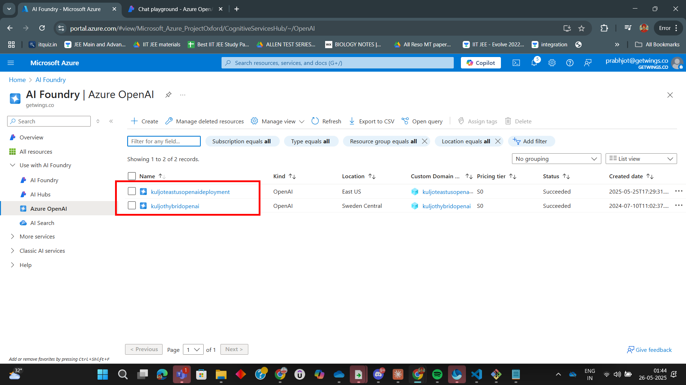

# Lab: Multi-Region Azure OpenAI Load Balanced Deployments with Azure API Management (APIM)

In this lab, you'll learn how to deploy Azure OpenAI in multiple regions and configure Azure API Management (APIM) to load balance requests across these regions for high availability and performance. Follow the steps below and refer to the images in the `Assets` folder for visual guidance.

---

## Step 1: Create Multi-Region Azure OpenAI Deployments

Begin by deploying Azure OpenAI resources in multiple Azure regions.

---

## Step 2: Add Each Azure OpenAI Deployment as a Backend in APIM

Add each regional Azure OpenAI deployment as a backend in your APIM instance.

---

## Step 3: Create Circuit Breaker Rules for each OpenAI Backend

---

## Step 4: Create a Load Balancer Pool with OpenAI Backends

---

## Step 5: Set Up Load Balancing Policy in APIM

Edit your APIM policy to enable load balancing across the backend pool.

---

## Step 5: Test Load Balanced API Endpoint

Use the APIM Test Console or Developer Portal to send requests and observe how traffic is distributed across regions.

---

## Step 6: Analyze Load Balancing Results

Review the results and verify that requests are being served by different regions, ensuring high availability and optimal performance.

---

## Summary

You have successfully configured multi-region Azure OpenAI deployments and set up Azure API Management to load balance requests across these regions. This architecture provides resilience, improved latency, and disaster recovery for your AI-powered APIs.

---