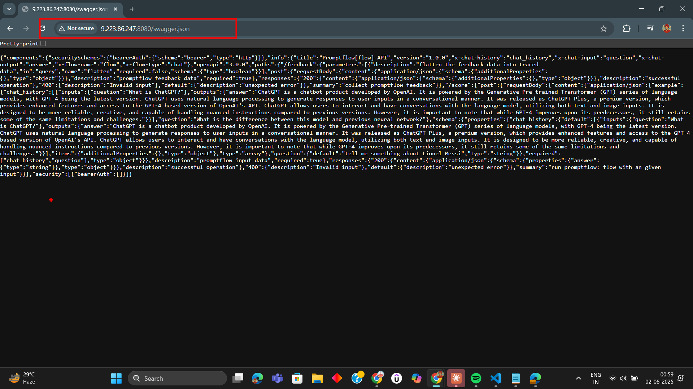
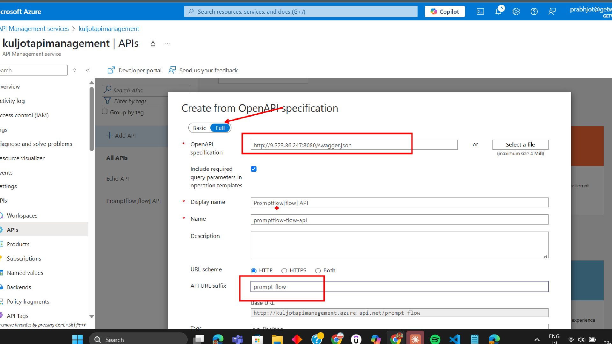
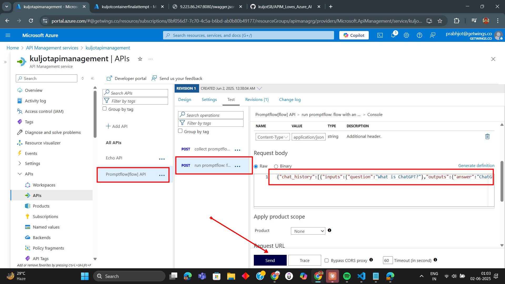

## Prompt Flow Integration with Azure APIM 

### Step 1: Fetch the OpenAPI Spec for the prompt-flow deployed on Azure Container Instance (ACI)

---

### Step 2: Import the Prompt Flow as an OpenAPI API

---

### Step 3: try the API Operation - Send Message to Prompt Flow

---