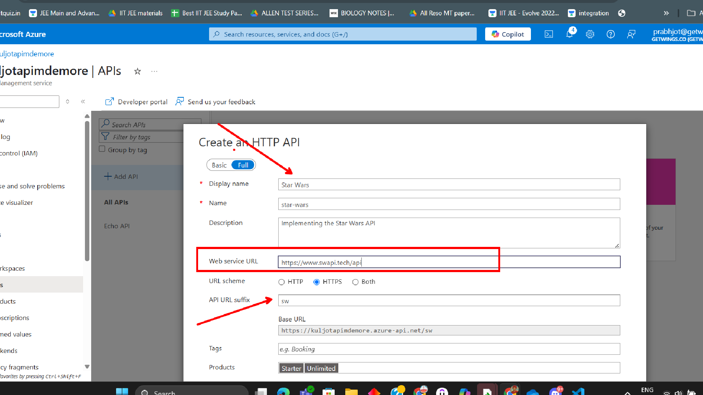
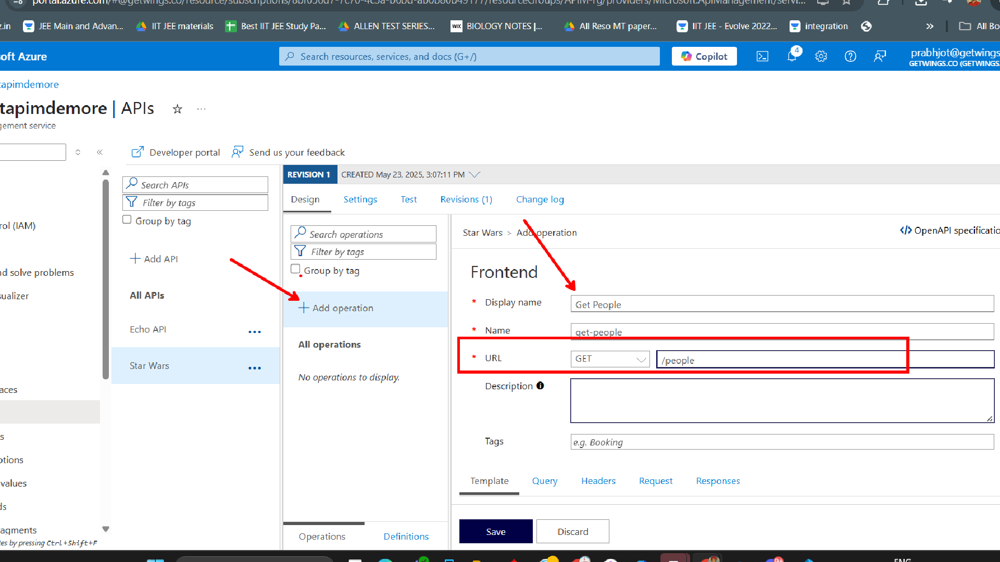
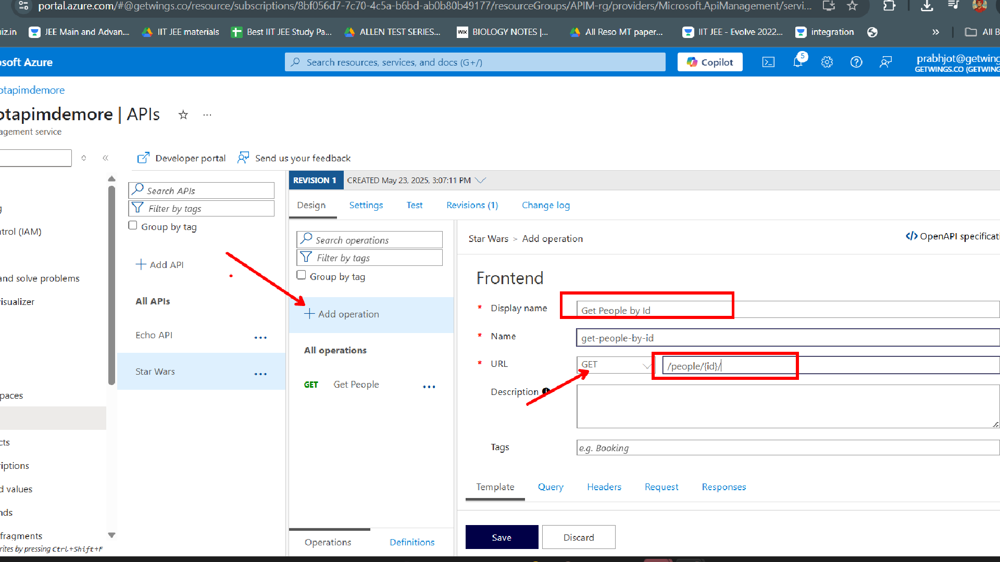

# Lab 01: Importing an HTTP API into Azure API Management

In this lab, you will learn how to import an HTTP API into Azure API Management (APIM) and create two operations: **Get People** and **Get People by ID** using the [Star Wars API (SWAPI)](https://www.swapi.tech/api/). You will also use supporting images from the Assets folder for guidance.

---

## Prerequisites

- Access to an Azure subscription
- An existing API Management instance

---

## Step 1: Import the HTTP API

1. **Navigate to your APIM instance** in the [Azure Portal](https://portal.azure.com/).
2. In the left menu, select **APIs**.
3. Click **+ Add API** and choose **HTTP**.

   

4. In the **Create from definition** section, enter the following details:
   - **Display name:** SWAPI
   - **Web service URL:** `https://www.swapi.tech/api/`
   - **API URL suffix:** `swapi`
   - Leave other fields as default.

5. Click **Create**.

---

## Step 2: Add the "Get People" Operation

1. In your newly created SWAPI API, click **+ Add Operation**.
2. Fill in the operation details:
   - **Display name:** Get People
   - **Name:** get-people
   - **URL:** `/people`
   - **Method:** GET

   

3. Click **Save**.

---

## Step 3: Add the "Get People by ID" Operation

1. Click **+ Add Operation** again.
2. Fill in the operation details:
   - **Display name:** Get People by ID
   - **Name:** get-people-by-id
   - **URL:** `/people/{id}`
   - **Method:** GET

   

3. Under **Request**, add a parameter:
   - **Name:** id
   - **Type:** Path
   - **Required:** Yes

4. Click **Save**.

---

## Step 4: Test the Operations

1. In the APIM portal, select the **Test** tab for your API.
2. Test the **Get People** operation by clicking **Send**.
3. Test the **Get People by ID** operation by entering a valid ID (e.g., `1`) and clicking **Send**.

---

## Summary

You have successfully imported an HTTP API into Azure API Management and created two operations: **Get People** and **Get People by ID**. You can now manage, secure, and monitor these APIs using APIM.

---