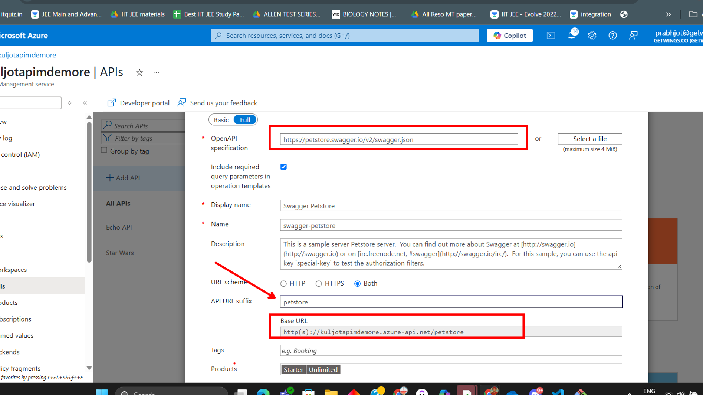
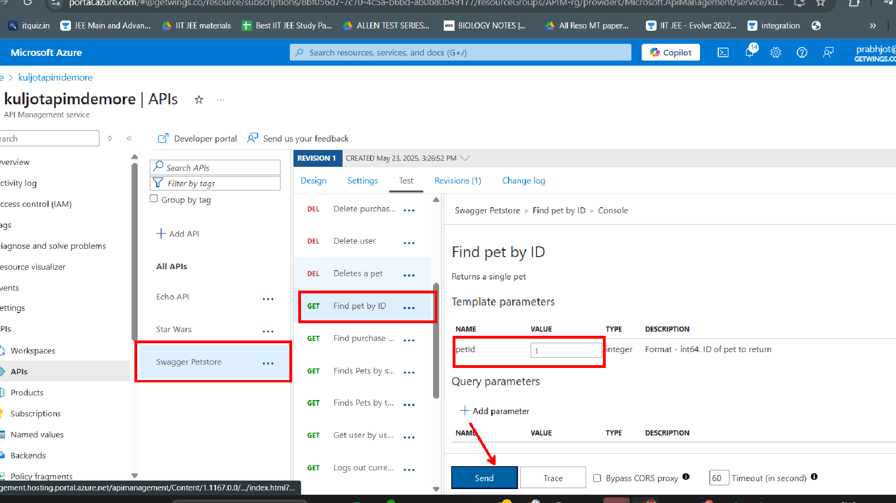

# Lab 02: Importing an API Using an OpenAPI Specification

In this lab, you will learn how to import an API into Azure API Management (APIM) using an OpenAPI (Swagger) specification from a URL and test the **Find Pet by ID** operation. Supporting images from the Assets folder are included for guidance.

---

## Prerequisites

- Access to an Azure subscription
- An existing API Management instance

---

## Step 1: Import the OpenAPI Specification

1. **Navigate to your APIM instance** in the [Azure Portal](https://portal.azure.com/).
2. In the left menu, select **APIs**.
3. Click **+ Add API** and choose **OpenAPI**.

   

4. In the **Create from definition** section, select **Full** and enter the following details:
   - **OpenAPI specification URL:** `https://petstore.swagger.io/v2/swagger.json`
   - **Display name:** Petstore API
   - **API URL suffix:** `petstore`
   - Leave other fields as default.

5. Click **Create**.

---

## Step 2: Locate the "Find Pet by ID" Operation

1. In your newly imported Petstore API, locate the operation named **Find pet by ID** (with the path `/pet/{petId}` and method `GET`).

   

---

## Step 3: Test the "Find Pet by ID" Operation

1. Select the **Test** tab for your API in the APIM portal.
2. Choose the **Find pet by ID** operation.
3. Enter a valid Pet ID (e.g., `1`) in the parameter field.
4. Click **Send** to test the operation and view the response.

---

## Summary

You have successfully imported an API into Azure API Management using an OpenAPI specification from a URL and tested the **Find Pet by ID** operation. This process allows you to quickly onboard APIs and manage them using APIM.

---