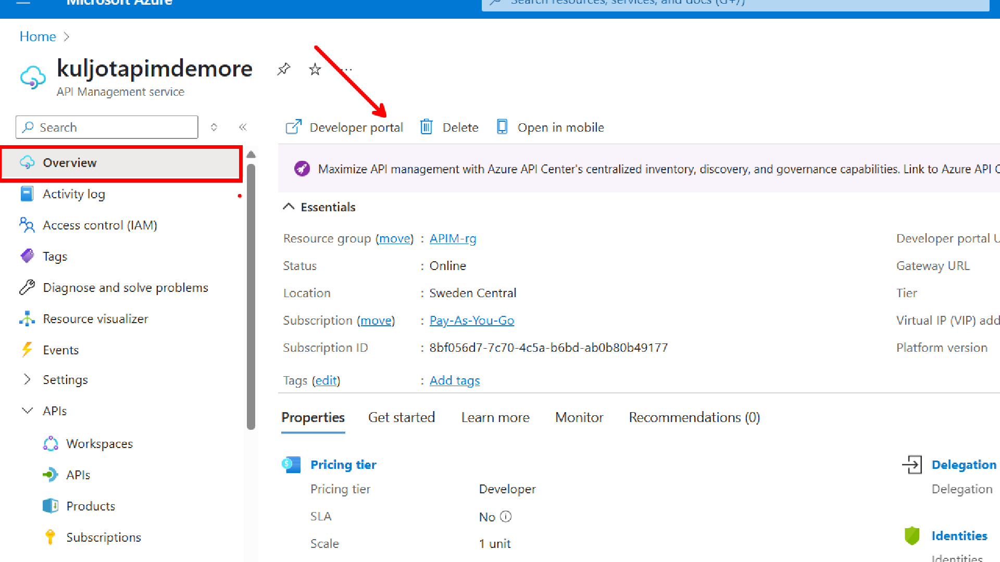
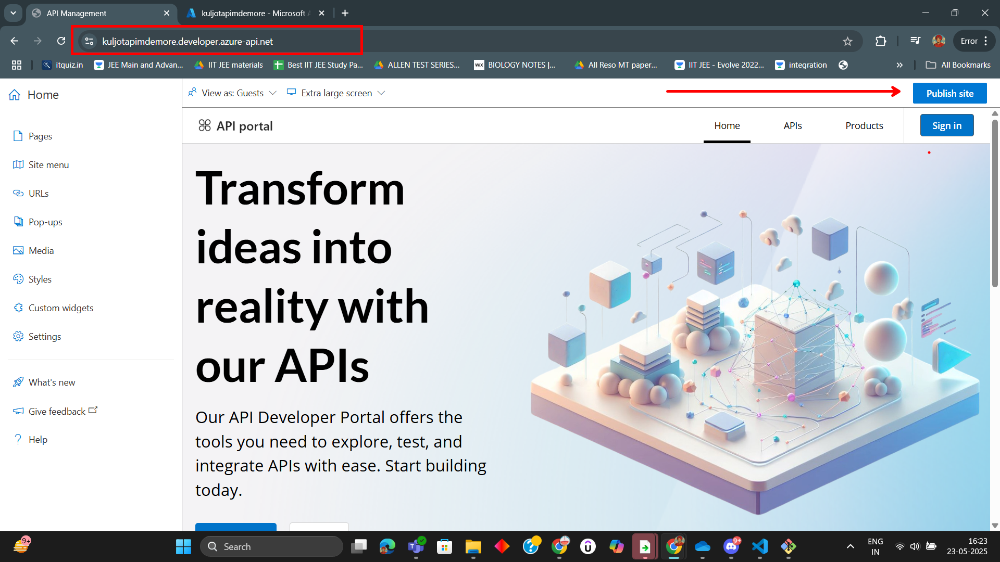
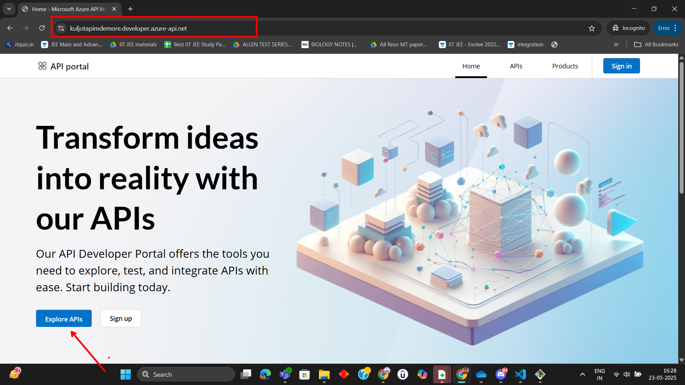
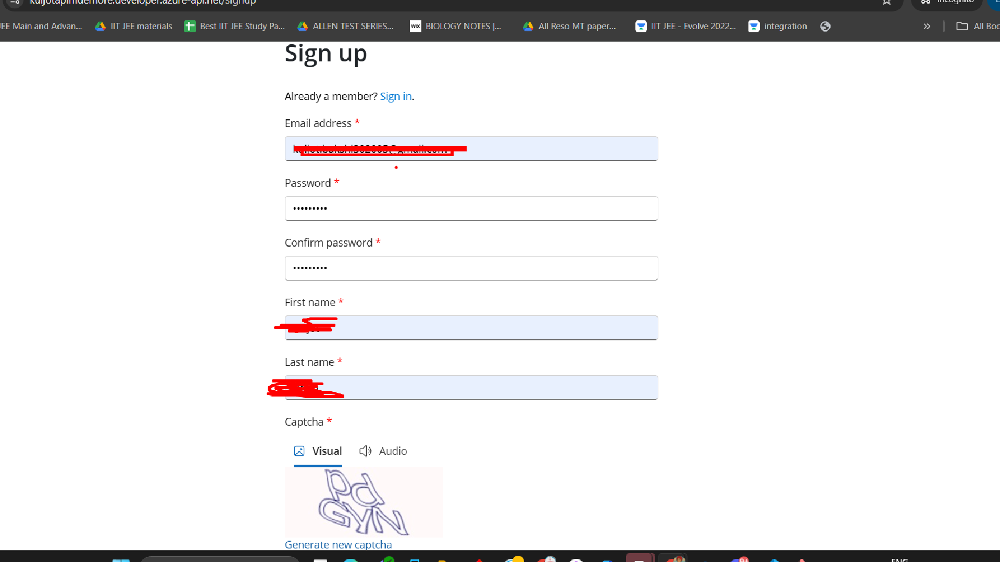
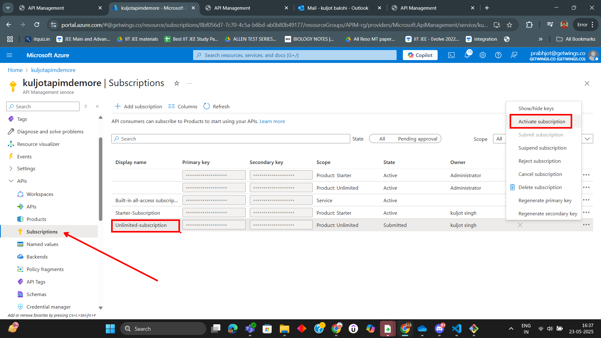
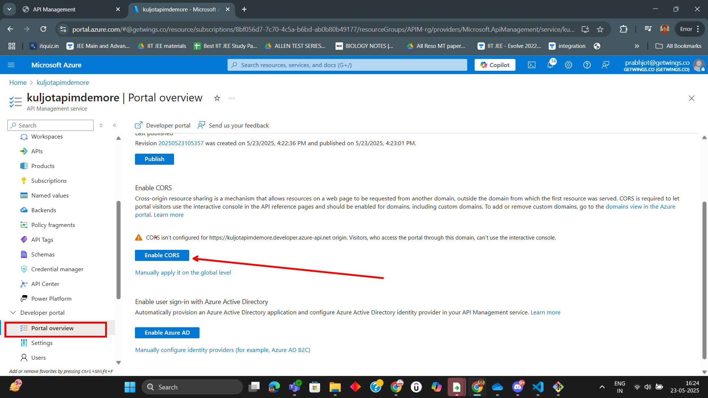
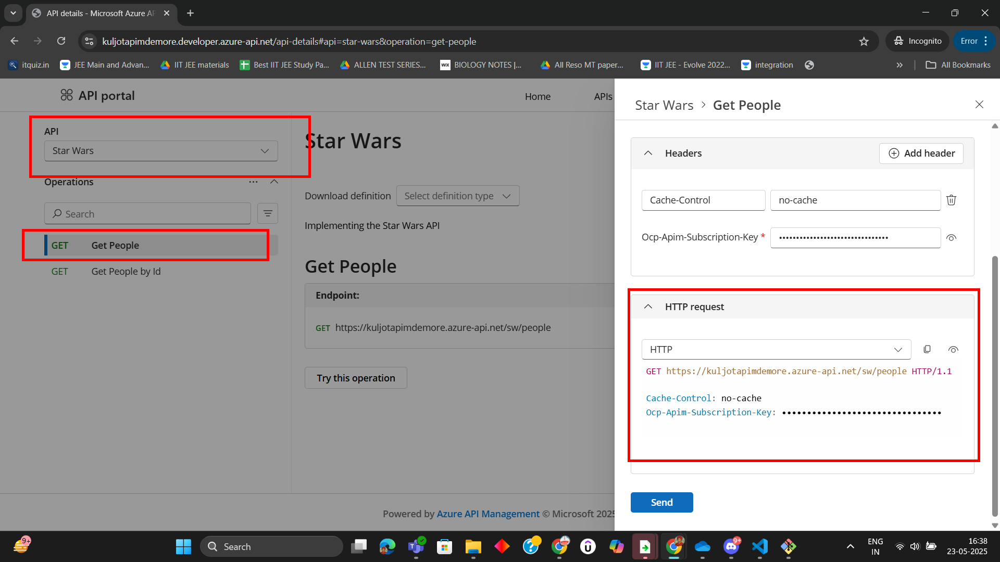
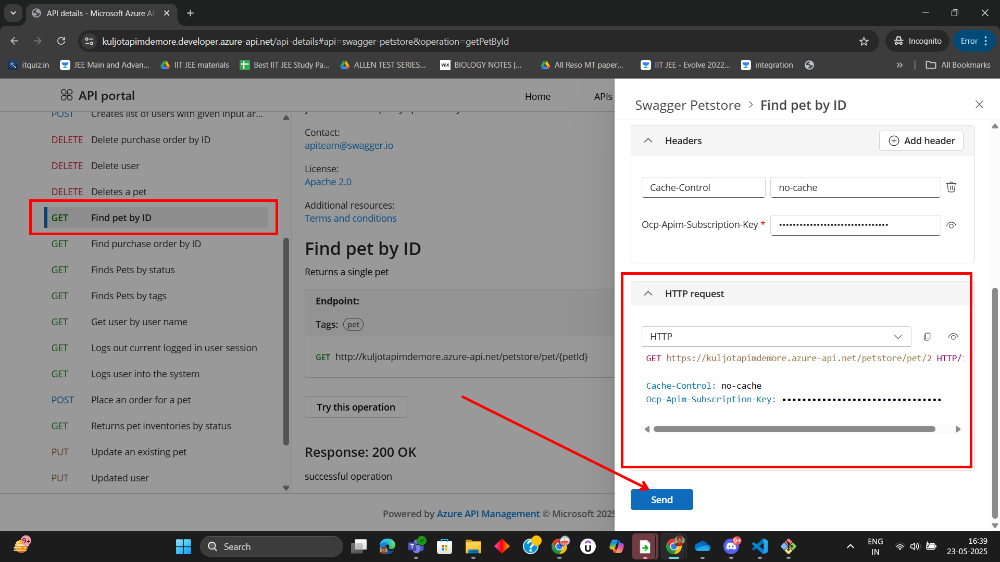

# Lab 03: Dev Portal Azure APIM Walkthrough

In this lab, you will explore the Developer Portal in Azure API Management (APIM). The Developer Portal allows API consumers to discover, learn about, and test APIs. This walkthrough uses supporting images from the Assets folder for guidance.

---

## Prerequisites

- Access to an Azure subscription
- An existing API Management instance with APIs (e.g., SWAPI and Petstore) already imported

---

## Step 1: Access the Developer Portal

1. **Navigate to your APIM instance** in the [Azure Portal](https://portal.azure.com/).
2. In the left menu, select **Developer portal**.

   

3. Click **Developer portal** to open it in a new browser tab.

---

## Step 2: Publish the Developer Portal (if not already published)

1. If this is your first time accessing the portal, you may need to publish it.
2. Click **Publish** in the top menu.

   

---

## Step 3: Explore the Developer Portal as an Unauthenticated User

1. Open a new incognito/private browser window.
2. Paste the Developer Portal URL and press Enter.
3. Browse the portal to see what unauthenticated users can access.

   

---

## Step 4: Sign In to the Developer Portal

1. Click **Sign in** at the top right of the Developer Portal.

   

2. Use your Azure credentials to sign in.

---

## Step 5: Activate Unlimited Subscription

1. Go to the **Profile** or **Subscriptions** section in the Developer Portal.
2. Click **Activate** for the unlimited subscription.

   

---

## Step 6: Enable CORS for API Testing (if required)

1. In the Azure Portal, go to your APIM instance.
2. Under **APIs**, select your API (e.g., SWAPI or Petstore).
3. Enable CORS in the settings to allow API testing from the portal.

   

---

## Step 7: Test the Star Wars API (SWAPI) from the Developer Portal

1. In the Developer Portal, go to the **APIs** section.
2. Select the **SWAPI** API.
3. Choose the **Get People** operation.

   

4. Click **Try it** or **Send** to test the operation and view the response.

---

## Step 8: Test the Petstore API from the Developer Portal

1. In the Developer Portal, go to the **APIs** section.
2. Select the **Petstore** API.
3. Choose the **Find pet by ID** operation.

   

4. Enter a valid Pet ID (e.g., `1`) and click **Send** to test the operation and view the response.

---

## Summary

You have successfully accessed and explored the Azure API Management Developer Portal, published it, browsed as both authenticated and unauthenticated users, activated a subscription, enabled CORS, and tested both the Star Wars API and Petstore API operations from the portal.

---