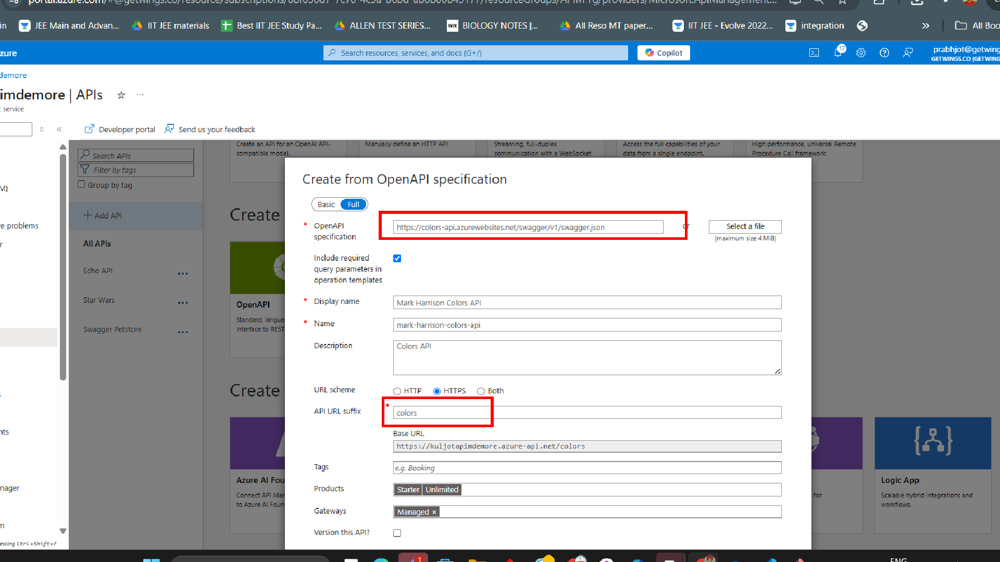
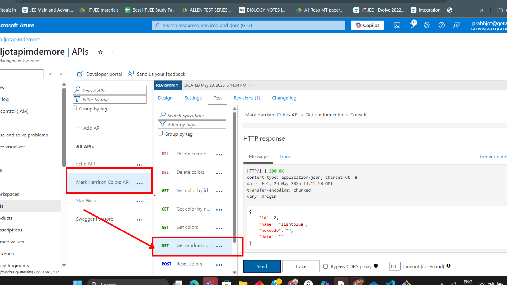
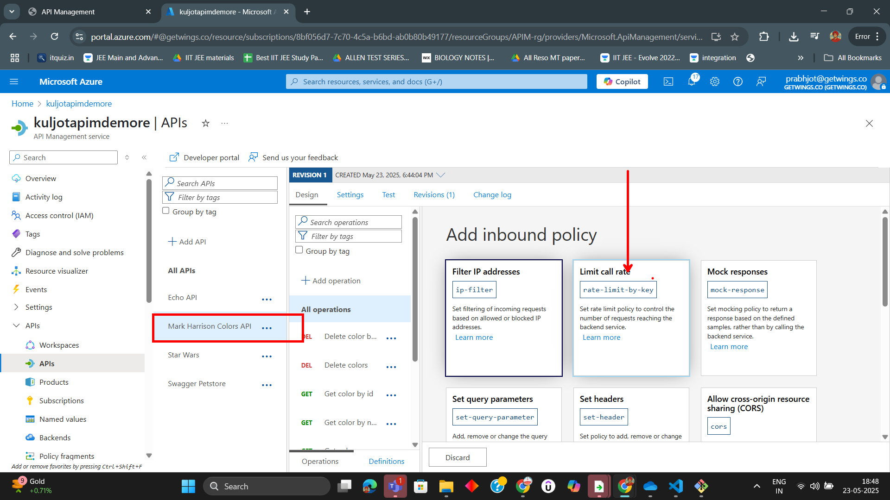
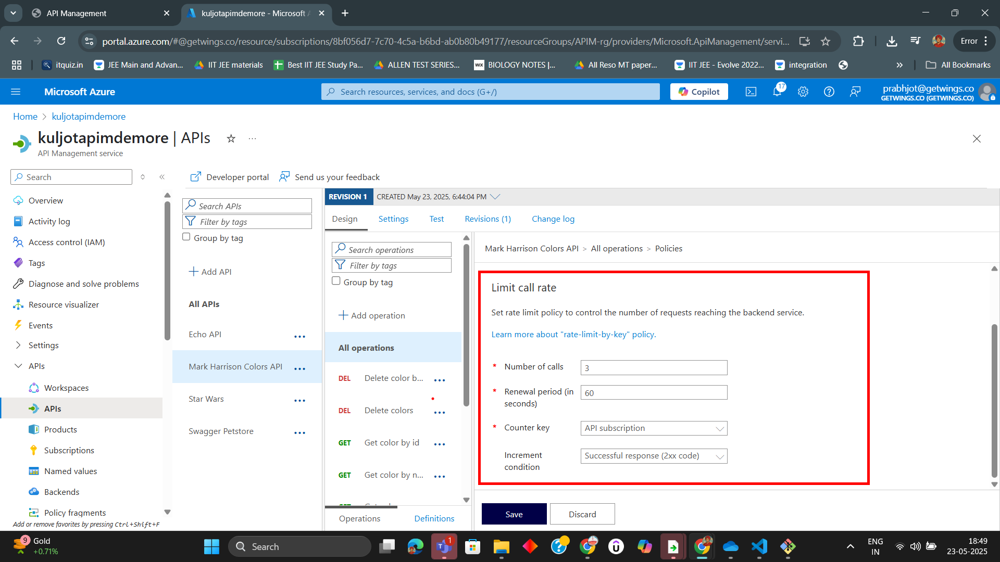
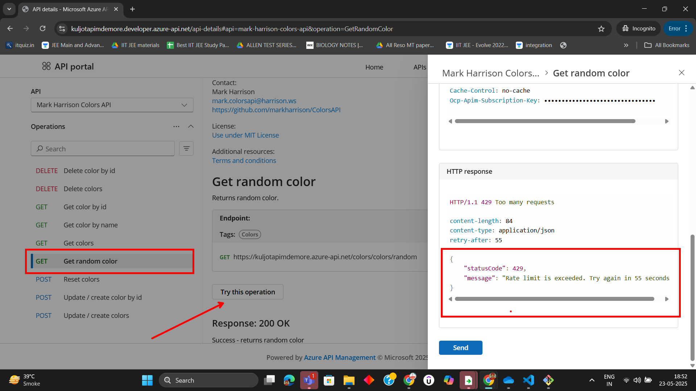
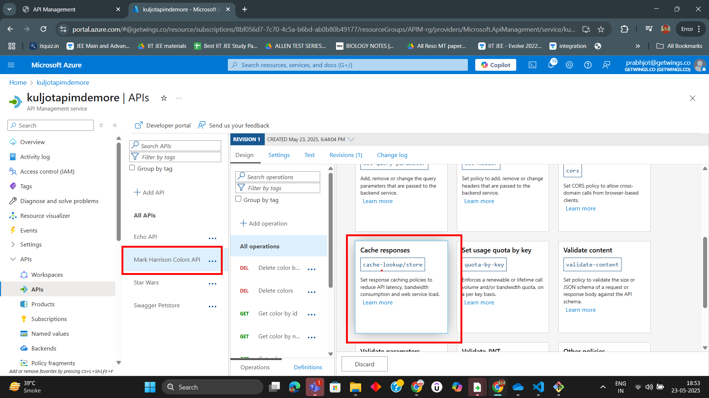
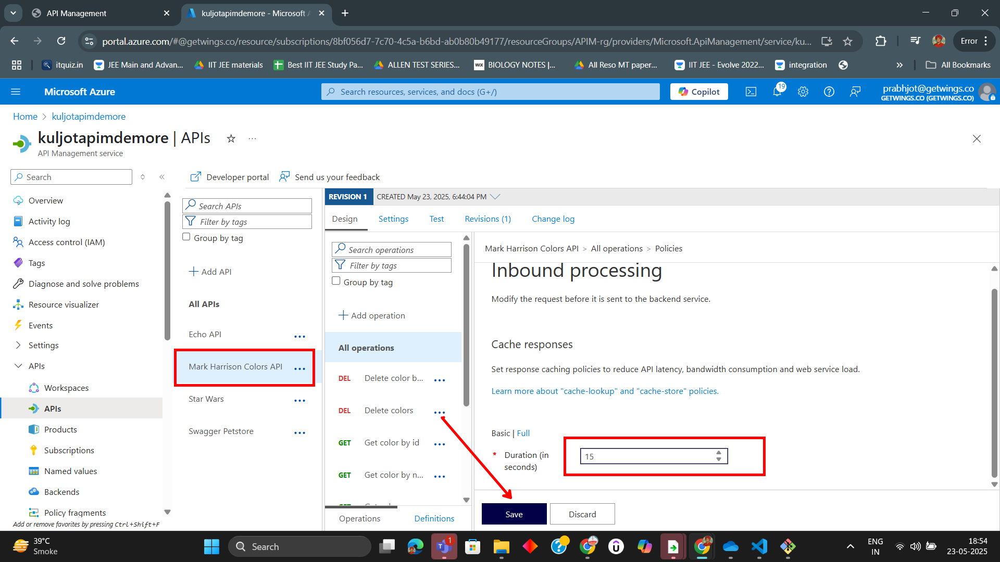
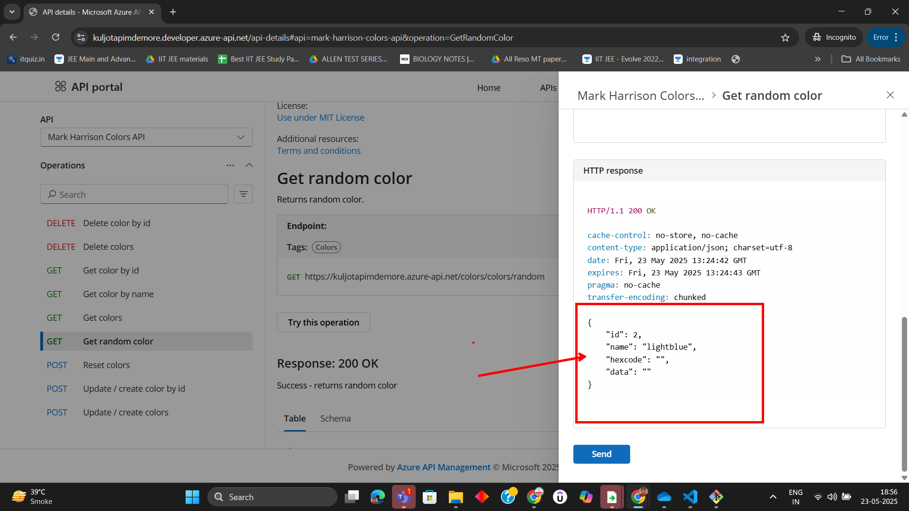

# Lab 04: Creating Rate Limit and Caching Policies for Colors API

In this lab, you will learn how to apply rate limiting and caching policies to the Colors API in Azure API Management (APIM). You will use step-by-step images from the Assets folder for guidance.

---

## Prerequisites

- Access to an Azure subscription
- An existing API Management instance
- The Colors API already imported into APIM

---

## Step 1: Create a New OpenAPI API for Colors

1. In your APIM instance, go to the **APIs** section.
2. Click **+ Add API** and select **OpenAPI**.
3. Import the Colors API using its OpenAPI specification.

   

---

## Step 2: Test the Get Random Colors Operation

1. In the Colors API, locate the **Get Random Colors** operation.
2. Use the **Test** tab to send a request and observe the response.

   

---

## Step 3: Add a Rate Limit Policy

1. In the Colors API, select the **Get Random Colors** operation.
2. Click on the **Design** tab, then select **Add policy**.
3. Choose the **rate-limit-by-key** policy.
4. Set the rate limit values (e.g., 5 calls per 60 seconds).

   

5. Save the policy.

---

## Step 4: Configure Rate Limit Policy Specifications

1. Review and adjust the policy XML as needed to match your requirements.
2. Save and close the policy editor.

   

---

## Step 5: Test the Rate Limit Policy

1. Use the Developer Portal or Test tab to send multiple requests to the **Get Random Colors** operation.
2. Observe that after exceeding the rate limit, further requests are blocked.

   

---

## Step 6: Add a Caching Policy

1. In the Colors API, select the **Get Random Colors** operation.
2. Click on **Add policy** and choose the **cache-lookup** and **cache-store** policies.
3. Set the caching duration (e.g., 60 seconds).

   

---

## Step 7: Configure Caching Policy Specifications

1. Review and adjust the policy XML for caching as needed.
2. Save and close the policy editor.

   

---

## Step 8: Test the Caching Policy

1. Use the Developer Portal or Test tab to send repeated requests to the **Get Random Colors** operation.
2. Observe that cached responses are returned within the caching duration.

---

## Summary

You have successfully applied rate limiting and caching policies to the Colors API in Azure API Management. These policies help protect your API from overuse and improve performance for repeated requests.

---